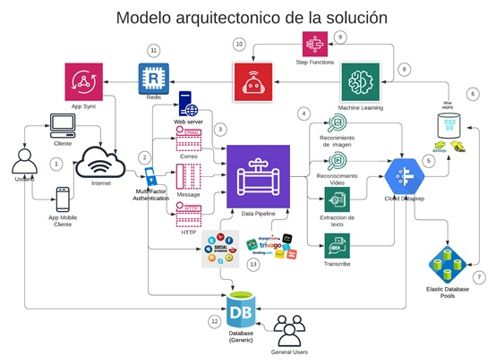

# GROUP 1

[Project title]
__ASISTENTE PARA RECOMENDAR ACTIVIDADES__

[Project Brief]

Diseñar un prototipo de asistente para recomendar a los usuarios que actividades puede realizar dependiendo del día, hora y estado de ánimo, a treves de una aplicación web

[Link to the presentation]

## Members

 - Linda Castillo
 - Karen Segura
 - Jean Tapia
 - Julio Villacis

## Problem statement

[Las personas en la actualidad según el estado de ánimo, basados en hechos y circunstancias individuales realizan diferentes tipos de actividades que conllevan a mejorar su estado de ánimo o no.

En la vida cotidiana los estados de ánimo tienen un valor y significado concreto para cada persona y, además, un propósito. Las ocupaciones son centrales en la identidad y capacidades de una persona e influyen en el modo en el que uno emplea el tiempo y toma decisiones.
]

## Proposal

[SDebido al problema planteado, se ha recurrido a realizar una app que nos permite recomendar actividades de cualquier índole basados en el circulo social que rodea a un usuario, por lo general estos interactúan en la actualidad con las redes sociales y sus búsquedas en la web.
La app realizara recomendaciones de acuerdo con la hora y el estado de ánimo publicados en las diferentes redes sociales, puede ser ingresado al inicio del día, pero puede ser actualizado a lo largo del día de acuerdo al cambio que realice el usuario en sus estados, para recomendar las mejores sugerencias. Adicional, permitirá buscar en la cache de su dispositivo o equipo que use con mayor frecuencia
]

## Arquitectura

 

Fase	Descripci�n
1	Ingreso a la aplicaci�n puede ser via pc o smartphone
2	Proceso de autenticaci�n por:
Usuarios propios
Usuarios de redes sociales (Facebook, twitter, etc.)
3	Generaci�n de flujos de datos
4	Extracci�n, transformaci�n de datos
5	Carga de datos
6	Carga de datos a BD Hadoop para acceso de gran volumen de datos
7	Carga de datos en BD almacenamiento de gran volumen persistente
8	Aprendizaje en base de pasos funcionales
9	Pasos funcionales
10	Activaci�n de robots para preparaci�n sincronizar la informaci�n
11	Proceso de sincronizaci�n de la informaci�n, BD en memoria para acceso r�pido para las consultas
12	BD SQL con la informaci�n de usuarios, de Proveedores
13	Proveedores, redes sociales

4.2 Dise�o de la aplicaci�n

Resumen de partes del sistema:
�	Acceso controlado mediante Google/red social, o usuario creado.
�	Acceso a la pantalla donde se visualizar� todo tipo de actividades que frecuentan su grupo de contactos o los estados de �nimo que publique el usuario en la red social con la que inicie sesi�n.
�	Permitir� las b�squedas frecuentes que el usuario realice a trav�s de las redes sociales. Adem�s, contar� con la ubicaci�n exacta de donde est� dicha recomendaci�n.

]

## Proof of concept (DEMO)

[Debido al problema planteado, se ha recurrido a realizar una app que nos permite recomendar actividades de cualquier �ndole basados en el circulo social que rodea a un usuario, por lo general estos interact�an en la actualidad con las redes sociales y sus b�squedas en la web.
La app realizara recomendaciones de acuerdo con la hora y el estado de �nimo publicados en las diferentes redes sociales, puede ser ingresado al inicio del d�a, pero puede ser actualizado a lo largo del d�a de acuerdo al cambio que realice el usuario en sus estados, para recomendar las mejores sugerencias. Adicional, permitir� buscar en la cache de su dispositivo o equipo que use con mayor frecuencia.
]

## References
[Presentación Proyecto Final](https://youtu.be/SsDn3v59rr0)
