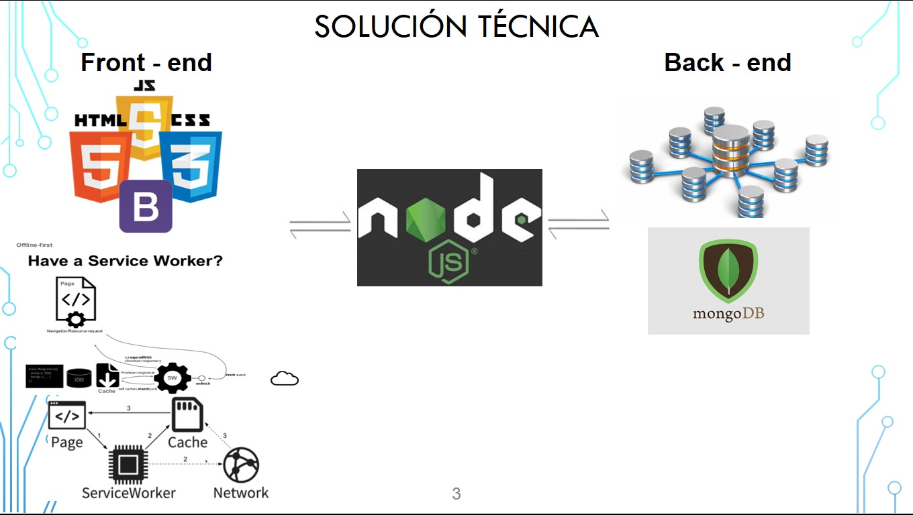
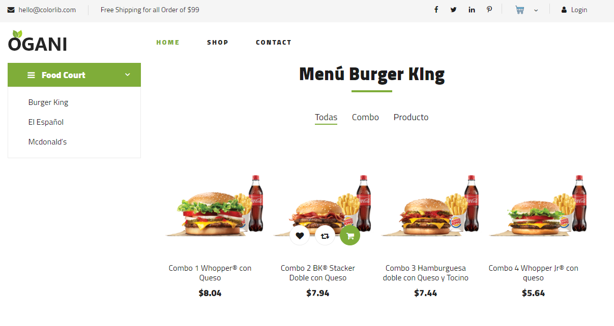
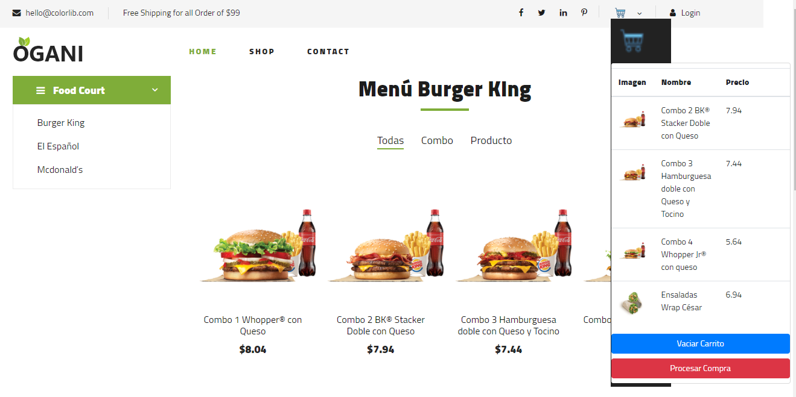
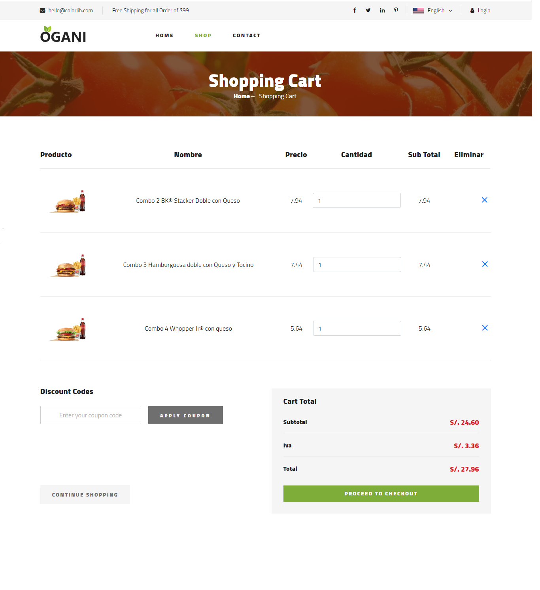
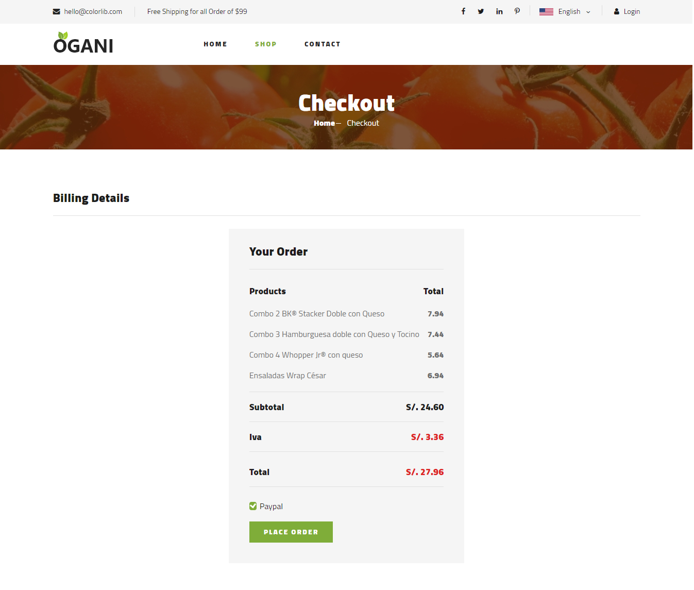
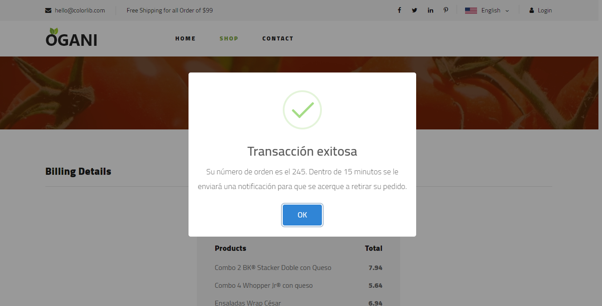
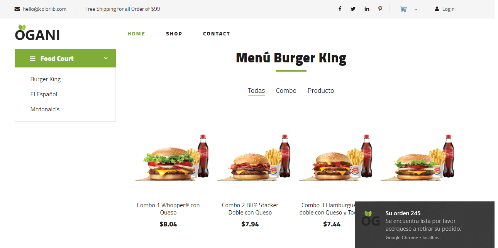

# GROUP 3

Order Food

[Project Brief]

[Link to the presentation]

## Members

 - Christian Apolinario Brunis
 - Cristhian Florencia Saltos
 - Omar Morejon 
 - Jajayra Castillo

## Problem statement

  - Actualmente, el Patio de Comidas de los Centros Comerciales de nuestro país, no cuentan con espacio suficiente para la implementación de medidas de distanciamiento 
 durante el proceso de selección, pago y retiro de alimentos por parte de los clientes que visitan el Mall, afectando de esta manera la política de distanciamiento exigida por el Gobierno
 que busca evitar un nuevo brote de contagios por covid-19
 
  
 
## Proposal

 - Cada mesa del patio de comidas tendra un código QR en el centro, el cual se puede escanear con el celular de las personas y este los redireccionará a la página web de nuestro sitio en internet, en donde podran encontrar todos los locales disponibles para realizar sus pedidos sin tener que aglomerarse en la caja de cada local.
 - Luego podran escoger el local y visualizar su menú, posterior podran realizar su orden en la cual podran ingresar sus datos para la facturación y hacer el pago corespondiente.
 - Cuando el pedido se encuentre atendido se enviará desde el local comercial una notificacion a la conexion del sitio web de cada cliente para que se acerque a retirar su pedido.
 - Toda la información mostrada se aloja en un servidor central, el cual envia las peticiones a los locales del patio de comida.
	
	###Front - end
	- HTML5 + JS + CSS3 + BOOTSTRAP 4 + (API Offline, workers, indexDB) 
	
	###Back - end
<<<<<<< HEAD
	- NodeJs + MongoDB
=======
	- PHP + MongoDB
>>>>>>> d3ab34570d5f784d37eafc995b0d945d9fe4bb28

	
	

## Proof of concept (DEMO)

[Screenshopt of the demos + brief description ]

1: Esta imagen corresponde a la presentación de nuestro sitio OrderFood en el cual el cliente podrá seleccionar el combo o menú de preferencia de cualquier local de venta de comida sin tener que hacer largas filas. Una vez elegido su Orden de compra está será enviada al local afiliado a fin de que se registre dicha solicitud.

2: Luego se escogen los combos o productos, los cuales se van agregando al carrito de compras, y posteriormente se procede a procesar el pago.

3: Esta imagen muestra al cliente el precio, cantidad y total a pagar por los combos seleccionados a fin de que se procese su orden de compra.

4: El sitio nos muestra el detalle de nuestras selecciones con precio unitario, taxes y total a pagar; escogemos el metodo de pago y hacemos efectiva la transacción.

5: Luego de pulsar en el botón realizar el pedido, se visualiza un mensaje indicando que la transacción se ha realizado con éxito,  en el mismo mensaje nos indica el número de orden y el tiempo en el que se enviara una notificación indicando que debe acercarse a retirar su pedido.

6: Se visualiza un mensaje indicando al usuario que su orden esta lista y que por favor se acerque a retirar la misma.

## References

[Optional]
